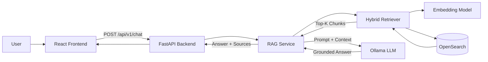
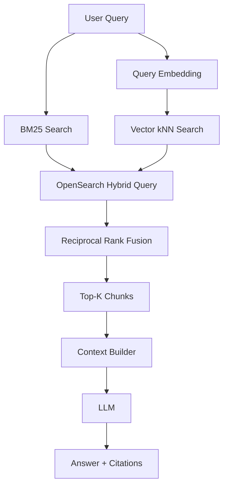
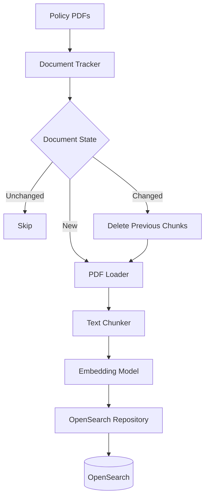
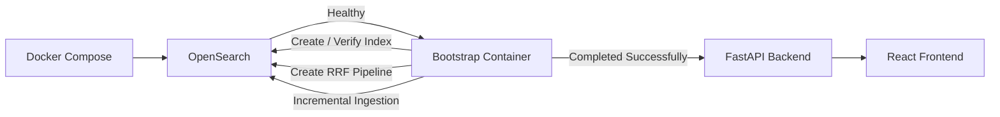
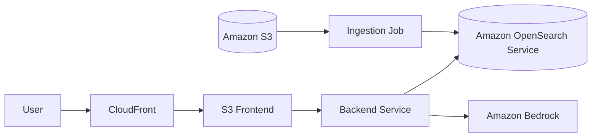

# Enterprise AI Support Engineer Copilot

An end-to-end **Enterprise Retrieval-Augmented Generation (RAG)** system for answering internal support and policy questions using a hybrid retrieval pipeline.

The system combines **BM25 keyword search** and **vector semantic search** inside OpenSearch, merges the rankings using **Reciprocal Rank Fusion (RRF)**, and provides grounded LLM responses with source citations.

> All knowledge-base documents included in this repository are synthetic and were created for educational and portfolio purposes. They do not represent real company policies.

---

## Overview

The project demonstrates a production-oriented RAG workflow covering:

- Document ingestion
- Incremental document tracking
- Chunking
- Embedding generation
- OpenSearch indexing
- BM25 retrieval
- Vector retrieval
- Hybrid search
- Reciprocal Rank Fusion
- Context construction
- LLM generation
- Source citations
- REST API
- React frontend
- Dockerized infrastructure
- Automated testing
- Retrieval evaluation
- CI with GitHub Actions

---

# Architecture

## System Architecture



The MVP intentionally keeps the online request path simple in order to clearly demonstrate the core RAG architecture.

---

# Hybrid Retrieval

The retrieval layer combines lexical and semantic search.



## Why Hybrid Search?

BM25 and vector search solve different retrieval problems.

### BM25

BM25 performs well when the user query contains terminology that directly appears in the source documents.

Examples:

- VPN
- SLA
- MFA
- AWS
- password

### Vector Search

Vector retrieval captures semantic similarity when the user's wording differs from the document wording.

### Reciprocal Rank Fusion

BM25 scores and vector similarity scores are not directly comparable.

Instead of manually combining incompatible scores, OpenSearch uses **Reciprocal Rank Fusion (RRF)** to combine the rankings produced by both retrieval methods.

```text
BM25 Results
      \
       \
        → RRF → Final Ranking
       /
      /
Vector Results
```

---

# Ingestion Pipeline



The ingestion system tracks documents so that unnecessary reprocessing can be avoided.

Current behavior:

```text
New document
    → Load
    → Chunk
    → Embed
    → Index

Changed document
    → Delete old chunks
    → Reprocess
    → Reindex

Unchanged document
    → Skip

Deleted document
    → Remove from OpenSearch
```

This prevents the entire knowledge base from being embedded again every time the application starts.

---

# Bootstrap Process

The Docker environment uses a one-shot bootstrap container before starting the API.



The bootstrap process:

1. Waits for OpenSearch readiness.
2. Verifies Ollama availability.
3. Creates the knowledge-base index when required.
4. Creates or updates the OpenSearch RRF search pipeline.
5. Runs incremental document ingestion.
6. Exits successfully.
7. Allows the FastAPI backend to start.

This keeps initialization logic separate from request-serving logic.

---

# Retrieval Evaluation

The hybrid retrieval system was evaluated using a manually labeled dataset containing **20 enterprise support queries** covering all **10 synthetic knowledge-base documents**.

Evaluation is performed at the **document level**.

The evaluation suite uses `ranx`.

## Results

| Metric | Score |
|---|---:|
| Hit Rate@1 | **95.0%** |
| Hit Rate@3 | **100.0%** |
| Hit Rate@5 | **100.0%** |
| MRR@5 | **0.975** |
| NDCG@5 | **0.982** |

The correct document was retrieved within the **Top 3 results for all 20 evaluation queries**.

## Metric Interpretation

### Hit Rate@1

Measures whether a relevant document appears as the first result.

```text
19 / 20 queries
```

returned the expected document at Rank 1.

### Hit Rate@3

Measures whether the expected document appears within the first three retrieved documents.

```text
20 / 20 queries
```

succeeded.

### Hit Rate@5

Measures whether the expected document appears within the first five retrieved documents.

```text
20 / 20 queries
```

succeeded.

### MRR@5

Mean Reciprocal Rank measures how highly the first relevant document is ranked.

Current result:

```text
MRR@5 = 0.975
```

### NDCG@5

Normalized Discounted Cumulative Gain evaluates ranking quality while giving greater importance to documents retrieved near the top.

Current result:

```text
NDCG@5 = 0.982
```

---

# Retrieval Error Analysis

The evaluation suite also performs Top-1 error analysis.

One query did not retrieve the expected document at Rank 1:

```text
Query ID:
sla-001

Question:
كم الوقت المتوقع لحل مشكلة الدعم؟

Expected document:
07_اتفاقية_مستويات_الخدمة_SLA.pdf

Top-1 result:
02_دليل_استعادة_الحساب_ومشاكل_تسجيل_الدخول.pdf

Expected document rank:
2
```

The expected SLA document was still retrieved at **Rank 2**.

Because the RAG pipeline sends multiple top-ranked chunks to the context builder, the relevant document remains available to the generation stage.

No retrieval tuning was applied solely to optimize this single evaluation example.

> These metrics measure retrieval performance on the current manually labeled 20-query evaluation set. They should not be interpreted as overall system or LLM answer accuracy.

---

# Tech Stack

## AI / RAG

- Python
- LangChain components
- Ollama
- Qwen LLM
- Qwen Embeddings
- Retrieval-Augmented Generation
- Hybrid Retrieval
- Reciprocal Rank Fusion

## Search

- OpenSearch 3
- BM25
- kNN Vector Search
- OpenSearch Hybrid Query
- OpenSearch Search Pipelines
- RRF

## Backend

- FastAPI
- Pydantic
- Uvicorn

## Frontend

- React
- Vite

## Infrastructure

- Docker
- Docker Compose

## Testing

- Pytest
- HTTPX

## Evaluation

- ranx

## CI

- GitHub Actions

---

# Project Structure

```text
.
├── app/
│   ├── backend/
│   │   ├── api/
│   │   │   ├── dependencies.py
│   │   │   ├── models.py
│   │   │   └── routes.py
│   │   │
│   │   ├── embeddings/
│   │   │
│   │   ├── ingestion/
│   │   │   ├── Chunker.py
│   │   │   ├── Loader.py
│   │   │   ├── document_tracker.py
│   │   │   └── service.py
│   │   │
│   │   ├── llm/
│   │   │
│   │   ├── rag/
│   │   │   ├── bm25_retriever.py
│   │   │   ├── vector_retriever.py
│   │   │   ├── hybrid_retriever.py
│   │   │   └── service.py
│   │   │
│   │   ├── search/
│   │   │   ├── client.py
│   │   │   ├── index.py
│   │   │   ├── pipeline.py
│   │   │   └── repository.py
│   │   │
│   │   ├── bootstrap.py
│   │   ├── config.py
│   │   ├── main.py
│   │   └── Dockerfile
│   │
│   └── frontend/
│       ├── src/
│       │   ├── api/
│       │   ├── components/
│       │   ├── App.jsx
│       │   └── styles.css
│       │
│       ├── Dockerfile
│       ├── package.json
│       └── vite.config.js
│
├── data/
│   └── raw/
│       └── doc/
│
├── eval/
│   ├── questions.json
│   └── evaluate_retrieval.py
│
├── tests/
│   ├── test_api.py
│   ├── test_opensearch.py
│   ├── test_rag_service.py
│   ├── test_integration_rag.py
│   └── test_e2e_api.py
│
├── .github/
│   └── workflows/
│       └── ci.yml
│
├── docker-compose.yml
├── pytest.ini
├── requirements.txt
└── requirements-dev.txt
```

---

# Knowledge Base

The current synthetic knowledge base contains documents covering:

1. Password and MFA policy
2. Account recovery and login problems
3. VPN and remote work
4. Email and calendar support
5. Employee devices and performance
6. Incident management and escalation
7. Service Level Agreements
8. Information security and data handling
9. Internal AWS support
10. Technical support FAQs

---

# API

## Health Check

```http
GET /health
```

Response:

```json
{
  "status": "ok"
}
```

---

## Chat

```http
POST /api/v1/chat
```

Example:

```json
{
  "question": "كيف أغير كلمة المرور؟",
  "k": 5
}
```

Response structure:

```json
{
  "answer": "Generated grounded answer with citations [1].",
  "sources": [
    {
      "id": 1,
      "document_id": "01_سياسة_كلمات_المرور_والمصادقة.pdf",
      "filename": "01_سياسة_كلمات_المرور_والمصادقة.pdf",
      "chunk_ids": [
        "01_سياسة_كلمات_المرور_والمصادقة.pdf::chunk_1"
      ],
      "score": 0.016
    }
  ]
}
```

> RRF scores are ranking signals and should not be interpreted as confidence probabilities.

---

# Running Locally

## Requirements

Install:

- Docker Desktop
- Ollama
- Python 3.11+ for development and testing

---

## Ollama Models

Pull the embedding model:

```bash
ollama pull qwen3-embedding:latest
```

Pull the chat model:

```bash
ollama pull qwen3.5:9b
```

Verify installed models:

```bash
ollama list
```

---

# Start the Application

From the repository root:

```bash
docker compose up --build
```

Or run in detached mode:

```bash
docker compose up --build -d
```

Check containers:

```bash
docker compose ps
```

Expected services:

```text
copilot-opensearch
copilot-bootstrap
copilot-backend
copilot-frontend
```

The bootstrap container should complete successfully and exit after initialization.

---

# Local Services

Frontend:

```text
http://localhost:5173
```

Backend:

```text
http://localhost:8000
```

FastAPI Swagger documentation:

```text
http://localhost:8000/docs
```

OpenSearch:

```text
http://localhost:9200
```

---

# Testing

Install development dependencies:

```bash
pip install -r requirements-dev.txt
```

## Unit Tests

```bash
pytest -m "not integration and not e2e" -v
```

These tests do not require the complete infrastructure stack.

---

## Integration Tests

Integration tests validate:

- OpenSearch connectivity
- Knowledge-base index availability
- Indexed documents
- RRF pipeline availability
- Hybrid retrieval
- Relevant document retrieval

Run:

```bash
pytest -m integration -v
```

OpenSearch and Ollama must be available.

---

## End-to-End Tests

The E2E suite sends real requests through the complete application flow:

```text
HTTP Request
     ↓
FastAPI
     ↓
RAG Service
     ↓
Hybrid Retriever
     ↓
OpenSearch
     ↓
Ollama
     ↓
Answer + Sources
```

Run:

```bash
pytest -m e2e -v
```

---

# Retrieval Evaluation

With OpenSearch and Ollama running:

```bash
python -m eval.evaluate_retrieval
```

Example output:

```text
Retrieval Evaluation
========================================
Queries         20
hit_rate@1      0.9500
hit_rate@3      1.0000
hit_rate@5      1.0000
mrr@5           0.9750
ndcg@5          0.9815

Top-1 Error Analysis
========================================
Top-1 misses: 1
```

---

# Continuous Integration

GitHub Actions runs automatically on pushes and pull requests.

The current CI pipeline performs:

```text
Push / Pull Request
        |
        +----------------------+
        |                      |
        v                      v
Backend Unit Tests       Frontend Build
        |                      |
     Pytest                 Vite Build
```

Integration and E2E tests are currently kept separate because they require OpenSearch and Ollama infrastructure.

---

# Current MVP Scope

The current version focuses on clearly demonstrating the core AI engineering workflow:

```text
Documents
   ↓
Document Tracking
   ↓
Loading
   ↓
Chunking
   ↓
Embeddings
   ↓
OpenSearch
   ↓
BM25 + Vector Search
   ↓
RRF
   ↓
Top-K Context
   ↓
LLM
   ↓
Answer + Citations
```

---

# Current Limitations

The current MVP assumes that incoming user messages are enterprise support questions.

There is currently no intent router before the RAG pipeline.

Therefore:

- Greetings may enter retrieval.
- Completely unrelated queries may enter retrieval.
- Out-of-domain detection is limited.
- Conversation memory is not currently implemented.

These features are intentionally deferred to keep the first version focused on demonstrating and validating the core RAG system.

---

# Planned Improvements

Future iterations may include:

- Query and intent routing
- Out-of-scope detection
- Conversation memory
- Reranking
- Streaming LLM responses
- Authentication and authorization
- Retrieval observability
- LLM tracing
- Answer-level RAG evaluation
- AWS deployment
- Infrastructure as Code with Terraform

---

# Planned AWS Architecture

The application is designed so local components can later be replaced by managed AWS services.



Potential migration path:

```text
Local PDFs
→ Amazon S3

Local OpenSearch
→ Amazon OpenSearch Service

Local Ollama
→ Amazon Bedrock

Local Backend Container
→ AWS Container Service

Local Frontend
→ S3 + CloudFront
```

---

# Engineering Decisions

## Why OpenSearch?

OpenSearch supports both:

- Traditional lexical search
- Vector similarity search

inside the same search engine.

This allows the project to implement hybrid retrieval without maintaining separate keyword and vector databases.

---

## Why RRF?

BM25 and vector search generate scores with different meanings and scales.

RRF combines their **rank positions** instead of attempting to directly normalize and combine incompatible scores.

---

## Why Incremental Ingestion?

Re-embedding every document during every application startup is inefficient.

The document tracker allows the system to identify:

```text
New
Changed
Unchanged
Deleted
```

documents and process only the required changes.

---

## Why Separate Bootstrap From FastAPI?

FastAPI should primarily serve application requests.

Infrastructure initialization and ingestion are separate concerns.

The one-shot bootstrap service handles environment preparation before the API begins serving traffic.

---

## Why Evaluate Retrieval Separately?

A RAG application can produce poor answers because of either:

```text
Retrieval failure
```

or:

```text
Generation failure
```

Evaluating retrieval independently makes it possible to identify whether the correct source material reaches the LLM before evaluating generation quality.

---

# Purpose

This project was built as an **AI Engineering portfolio project** to demonstrate practical knowledge of:

- Retrieval-Augmented Generation
- Hybrid information retrieval
- BM25
- Vector search
- Embeddings
- Reciprocal Rank Fusion
- OpenSearch
- LLM integration
- Grounded generation
- Source attribution
- Backend API development
- React frontend integration
- Docker
- Incremental data pipelines
- Unit testing
- Integration testing
- End-to-end testing
- Information retrieval evaluation
- CI workflows
- Production-oriented system design

---

# Roadmap

```text
Core RAG                ✅
Hybrid Retrieval        ✅
OpenSearch              ✅
RRF                     ✅
Incremental Ingestion   ✅
FastAPI                 ✅
React Frontend          ✅
Docker Compose          ✅
Bootstrap               ✅
Unit Tests              ✅
Integration Tests       ✅
E2E Tests               ✅
Retrieval Evaluation    ✅
Error Analysis          ✅
GitHub Actions CI       ✅

AWS Deployment          ⏳
Terraform               ⏳
```

---

## License

This repository is intended for educational and portfolio use.