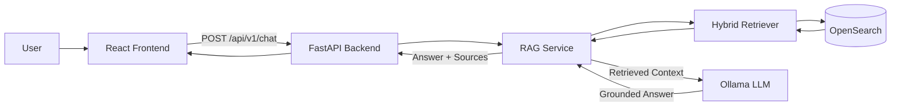
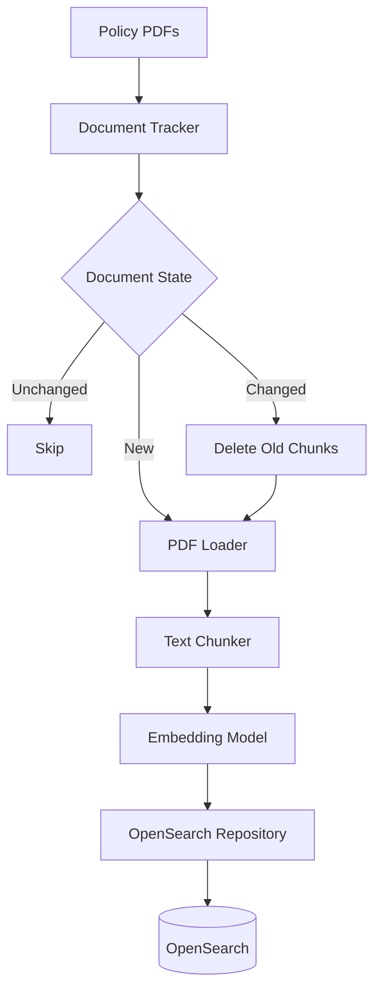
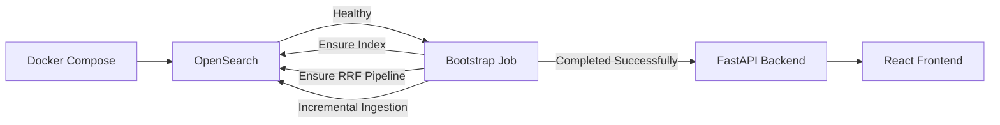

# Enterprise AI Support Engineer Copilot

An end-to-end enterprise support assistant built with **Hybrid Retrieval-Augmented Generation (RAG)**.

The system retrieves relevant information from internal knowledge-base documents using **BM25 lexical search** and **vector similarity search**, combines the rankings using **Reciprocal Rank Fusion (RRF)** in OpenSearch, and provides grounded answers with source citations.

> The documents included in this repository are synthetic portfolio data and do not represent real company policies.

---

## Features

- Hybrid RAG retrieval
  - BM25 keyword search
  - Vector similarity search
  - Reciprocal Rank Fusion (RRF)
- OpenSearch vector and text indexing
- Incremental document ingestion
- Document change tracking
- Source citations
- Arabic and English document support
- Local LLM inference using Ollama
- FastAPI REST API
- React frontend
- Docker Compose environment
- One-shot bootstrap initialization
- Unit, integration, and end-to-end testing

---

## System Architecture



The online request path is intentionally kept simple in the MVP to clearly demonstrate the core RAG workflow.

---

## Retrieval Architecture

The retrieval layer uses OpenSearch Hybrid Search.


### Why Hybrid Search?

Keyword search and semantic search solve different retrieval problems.

**BM25** performs well when the query contains exact terminology that also exists in the documents.

**Vector Search** captures semantic similarity even when the user and document use different wording.

The system combines both retrieval paths and uses **RRF** to produce a final ranked list without manually comparing incompatible BM25 and vector similarity scores.

---

## Ingestion Pipeline



The ingestion pipeline tracks document state so unchanged documents do not need to be embedded and indexed again.

When a document changes, its previous chunks are removed and the new version is indexed.

---

## Application Startup

The local Docker environment uses a one-shot bootstrap service before starting the API.



The bootstrap process:

1. Waits for OpenSearch.
2. Verifies Ollama availability.
3. Creates the OpenSearch index if required.
4. Creates or updates the Hybrid RRF search pipeline.
5. Runs incremental document ingestion.
6. Exits successfully.
7. Allows the API container to start.

This keeps infrastructure initialization separate from FastAPI request serving.

---

## Tech Stack

### AI / RAG

- Python
- LangChain utilities
- Ollama
- `qwen3-embedding`
- Qwen LLM
- Hybrid Retrieval
- RRF

### Search

- OpenSearch 3
- BM25
- kNN Vector Search
- OpenSearch Hybrid Search Pipeline

### Backend

- FastAPI
- Pydantic
- Uvicorn

### Frontend

- React
- Vite

### Infrastructure

- Docker
- Docker Compose

### Testing

- Pytest
- HTTPX

---

## Project Structure

```text
.
├── app/
│   ├── backend/
│   │   ├── api/
│   │   ├── embeddings/
│   │   ├── ingestion/
│   │   ├── llm/
│   │   ├── rag/
│   │   ├── search/
│   │   ├── bootstrap.py
│   │   ├── config.py
│   │   ├── main.py
│   │   └── Dockerfile
│   │
│   └── frontend/
│       ├── src/
│       │   ├── api/
│       │   └── components/
│       ├── Dockerfile
│       └── package.json
│
├── data/
│   └── raw/
│       └── doc/
│
├── tests/
│
├── docker-compose.yml
├── requirements.txt
├── requirements-dev.txt
└── pytest.ini
```

---

## API

### Health Check

```http
GET /health
```

Response:

```json
{
  "status": "ok"
}
```

### Chat

```http
POST /api/v1/chat
```

Example request:

```json
{
  "question": "كيف أغير كلمة المرور؟",
  "k": 5
}
```

Example response structure:

```json
{
  "answer": "Answer generated using the retrieved enterprise knowledge...",
  "sources": [
    {
      "id": 1,
      "document_id": "01_سياسة_كلمات_المرور_والمصادقة.pdf",
      "filename": "01_سياسة_كلمات_المرور_والمصادقة.pdf",
      "chunk_ids": [
        "01_سياسة_كلمات_المرور_والمصادقة.pdf::chunk_1"
      ],
      "score": 0.016
    }
  ]
}
```

> OpenSearch RRF scores represent ranking signals and should not be interpreted as confidence probabilities.

---

## Running Locally

### Requirements

Install:

- Docker Desktop
- Python 3.11+ for local development/testing
- Ollama

Pull the required models:

```bash
ollama pull qwen3-embedding:latest
ollama pull qwen3.5:9b
```

Verify Ollama:

```bash
ollama list
```

---

### Start the Application

From the project root:

```bash
docker compose up --build
```

Or run it in detached mode:

```bash
docker compose up --build -d
```

Check container status:

```bash
docker compose ps
```

The application will be available at:

```text
Frontend:
http://localhost:5173

Backend:
http://localhost:8000

FastAPI Docs:
http://localhost:8000/docs

OpenSearch:
http://localhost:9200
```

---

## Testing

Install development dependencies:

```bash
pip install -r requirements-dev.txt
```

### Unit Tests

```bash
pytest -m "not integration and not e2e" -v
```

### Integration Tests

Integration tests verify the real retrieval infrastructure, including:

- OpenSearch connectivity
- Knowledge-base index
- Indexed documents
- RRF search pipeline
- Hybrid retrieval

Run:

```bash
pytest -m integration -v
```

### End-to-End Tests

The E2E test sends a real HTTP request through:

```text
FastAPI
  ↓
RAG Service
  ↓
Hybrid Retriever
  ↓
OpenSearch
  ↓
Ollama
  ↓
Answer + Sources
```

Run:

```bash
pytest -m e2e -v
```

The Docker environment and Ollama must be running before executing integration or E2E tests.

---

## Current MVP Scope

The current version focuses on demonstrating the core RAG engineering workflow:

```text
Documents
   ↓
Incremental Ingestion
   ↓
Chunking
   ↓
Embeddings
   ↓
OpenSearch
   ↓
BM25 + Vector Search
   ↓
RRF
   ↓
Context
   ↓
LLM
   ↓
Answer + Citations
```

The MVP intentionally avoids adding unnecessary application layers before the core retrieval system is validated.

---

## Current Limitations

The current version assumes that user messages are enterprise support questions.

As a result, greetings, unrelated questions, or out-of-domain requests may still enter the RAG pipeline.

This behavior is intentionally left simple in the first version so the architecture clearly demonstrates the core RAG implementation.

---

## Planned Improvements

Future iterations may include:

- Query / intent routing
- Out-of-scope detection
- Conversation memory
- Reranking
- Streaming responses
- Authentication and authorization
- Observability and tracing
- RAG evaluation pipeline
- AWS deployment
- Infrastructure as Code with Terraform

---

## Cloud Roadmap

A future AWS architecture can replace local infrastructure while preserving the same application boundaries.

```text
Documents
   ↓
Amazon S3
   ↓
Ingestion Job
   ↓
Amazon OpenSearch Service

User
   ↓
CloudFront
   ↓
Frontend
   ↓
Backend Service
   ↓
OpenSearch
   ↓
Amazon Bedrock
```

The LLM and embedding layers are isolated behind application abstractions so local Ollama implementations can later be replaced with managed cloud models.

---

## Purpose

This project was built as an AI engineering portfolio project to demonstrate practical understanding of:

- Retrieval-Augmented Generation
- Hybrid retrieval
- Search systems
- Embeddings
- Vector databases
- LLM integration
- Backend API design
- Containerization
- Incremental data ingestion
- Testing AI applications
- Production-oriented software architecture

---

## License

This project is intended for educational and portfolio purposes.