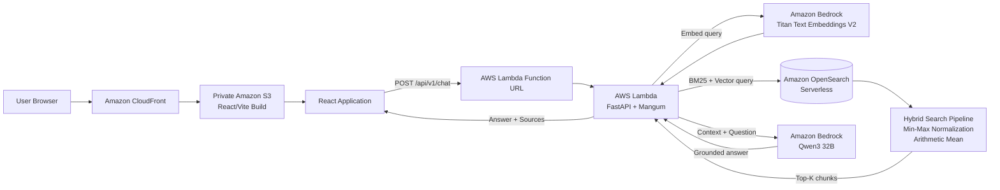
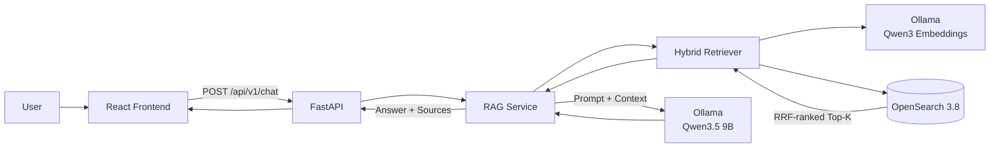
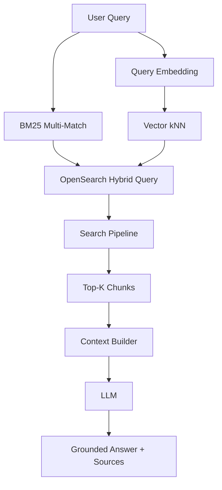
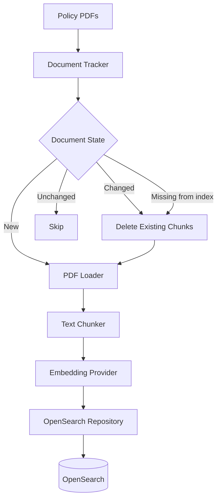
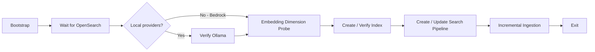

# Enterprise AI Support Engineer Copilot

A portfolio-grade **enterprise Retrieval-Augmented Generation (RAG) system** for answering internal support and policy questions with grounded answers and source citations.

The project supports two execution modes:

- **Local development:** Docker Compose + OpenSearch + Ollama
- **AWS deployment:** CloudFront + private S3 + AWS Lambda + Amazon Bedrock + OpenSearch Serverless

> The knowledge-base documents in this repository are synthetic and were created only for educational and portfolio purposes. They do not represent real company policies.

## Live Demo

**Frontend:** https://d253hf6flplgb.cloudfront.net/

The public deployment is intended as a portfolio demo. Do not submit sensitive or confidential information.

---

## What This Project Demonstrates

This project focuses on the engineering behind a practical RAG system rather than only wrapping an LLM with a chat interface.

It includes:

- PDF ingestion and chunking
- Incremental document tracking using file hashes
- Re-indexing when documents change
- Automatic removal of deleted documents
- BM25 lexical retrieval
- Vector semantic retrieval
- OpenSearch hybrid queries
- Provider-specific hybrid score fusion
- Arabic and English text search
- Grounded answer generation
- Source citations
- FastAPI REST API
- React/Vite frontend
- Dockerized local environment
- AWS serverless deployment
- Unit, integration, and end-to-end tests
- Retrieval evaluation with manually labeled queries
- GitHub Actions CI

---

# Architecture

The application intentionally keeps the online request path small and separates ingestion from request serving.

## AWS Deployment



### AWS Components

| Layer | Service / Technology |
|---|---|
| Frontend | React + Vite |
| CDN | Amazon CloudFront |
| Static hosting | Private Amazon S3 |
| Backend compute | AWS Lambda |
| API framework | FastAPI + Mangum |
| LLM | Amazon Bedrock — Qwen3 32B |
| Embeddings | Amazon Titan Text Embeddings V2 |
| Search | Amazon OpenSearch Serverless |
| Authentication to AWS services | IAM + SigV4 |
| Lambda image storage | Amazon ECR |

The Lambda function uses its **IAM execution role**. AWS access keys are not stored in application environment files.

---

## Local Development Architecture



Docker Compose runs:

```text
OpenSearch
   ↓ healthy
Bootstrap
   ↓ completed
FastAPI Backend
   ↓
React Frontend
```

Ollama runs on the host machine and is accessed from the containers through `host.docker.internal`.

---

# Local vs AWS Providers

The backend uses provider factories so the same RAG application can run locally or on AWS.

| Component | Local | AWS |
|---|---|---|
| LLM | Ollama / Qwen3.5 9B | Bedrock / Qwen3 32B |
| Embeddings | Ollama / Qwen3 Embeddings | Titan Text Embeddings V2 |
| Search | OpenSearch 3.8 | OpenSearch Serverless |
| Vector dimensions | Determined by local model | 1024 |
| Hybrid fusion | Reciprocal Rank Fusion | Min-max normalization + arithmetic mean |
| API runtime | Uvicorn / Docker | AWS Lambda + Mangum |
| Frontend | Vite | S3 + CloudFront |

Provider selection is controlled with environment variables:

```env
LLM_PROVIDER=ollama
EMBEDDING_PROVIDER=ollama
OPENSEARCH_PROVIDER=local
```

or:

```env
LLM_PROVIDER=bedrock
EMBEDDING_PROVIDER=bedrock
OPENSEARCH_PROVIDER=serverless
```

See [`.env.example`](.env.example) for the complete configuration template.

---

# Hybrid Retrieval

The retriever sends a single OpenSearch hybrid query containing two retrieval strategies.



## BM25

Lexical retrieval searches:

```text
content
content.ar^2
content.en
```

The Arabic subfield receives a higher boost while an English analyzed field is also available.

BM25 is especially useful for exact enterprise terminology such as:

- VPN
- SLA
- MFA
- AWS
- password-related terms

## Vector Search

The query is embedded and compared with indexed chunk vectors using kNN search.

Vector retrieval helps when the user's wording does not exactly match the document wording.

## Hybrid Fusion

The project uses different OpenSearch search-pipeline implementations depending on the environment.

### Local OpenSearch

```text
BM25 ranking
      \
       → Reciprocal Rank Fusion → Final ranking
      /
Vector ranking
```

The local RRF pipeline uses:

```text
rank_constant = 60
```

### OpenSearch Serverless

The AWS deployment uses:

```text
BM25 score ─┐
            ├─ min_max normalization
Vector score┘
                   ↓
            arithmetic_mean
                   ↓
              Final ranking
```

Current weights:

```text
BM25   = 0.5
Vector = 0.5
```

> Retrieval scores are ranking signals. They are **not confidence probabilities**.

---

# Grounded Generation

After retrieval, the RAG service:

1. Retrieves the Top-K chunks.
2. Deduplicates sources at the document level.
3. Builds numbered context blocks.
4. Sends only the retrieved context and user question to the LLM.
5. Instructs the model not to use outside knowledge.
6. Returns the answer together with source metadata.

Example context header:

```text
[1] 01_سياسة_كلمات_المرور_والمصادقة.pdf | Page 1
```

The generation prompt requires citations such as:

```text
يمكن إعادة تعيين كلمة المرور من بوابة الخدمة الذاتية [1].
```

If the retrieved context is insufficient, the assistant is instructed to say that the available information is not enough rather than inventing a policy.

---

# Ingestion Pipeline



The ingestion workflow tracks each document using a stable document ID and a file hash.

Current behavior:

```text
New document
→ load
→ chunk
→ embed
→ index

Changed document
→ delete previous chunks
→ load
→ chunk
→ embed
→ re-index

Unchanged document + present in OpenSearch
→ skip

Unchanged document + missing from OpenSearch
→ re-index

Deleted source document
→ remove indexed chunks
→ remove local state
```

This avoids re-embedding the complete knowledge base on every startup.

The OpenSearch repository uses bulk operations for indexing and deletion.

---

# Bootstrap Process

Initialization is intentionally separated from request serving.



For AWS-backed providers, Ollama is skipped.

The request-serving Lambda does **not** run ingestion on every request. Ingestion remains an explicit administration/bootstrap workflow.

---

# Knowledge Base

The repository currently contains **10 synthetic Arabic enterprise-support documents** covering:

1. Password and MFA policy
2. Account recovery and login issues
3. VPN and remote work
4. Email and calendar support
5. Employee devices and performance
6. Incident management and escalation
7. Service Level Agreements
8. Information security and data handling
9. Internal AWS support
10. Technical support FAQs

These files exist only to provide a realistic RAG test corpus.

---

# Retrieval Evaluation

The project includes a manually labeled retrieval evaluation set with **20 support questions** mapped to expected documents.

Evaluation is performed at the **document level**, even though retrieval itself operates on chunks.

Run:

```bash
python -m eval.evaluate_retrieval
```

Metrics:

- Hit Rate@1
- Hit Rate@3
- Hit Rate@5
- MRR@5
- NDCG@5
- Top-1 error analysis

## Recorded Evaluation Runs

| Environment | Hit@1 | Hit@3 | Hit@5 | MRR@5 | NDCG@5 |
|---|---:|---:|---:|---:|---:|
| Local — Ollama + OpenSearch RRF | 95.0% | 100.0% | 100.0% | 0.9750 | 0.9815 |
| AWS — Titan + OpenSearch Serverless | 85.0% | 100.0% | 100.0% | 0.9250 | 0.9446 |

The AWS run still retrieved the expected document within the Top 3 for all 20 queries.

These metrics measure **retrieval performance on the current manually labeled evaluation set**. They should not be interpreted as overall system accuracy or LLM answer accuracy.

---

# API

## Health Check

```http
GET /health
```

Response:

```json
{
  "status": "ok"
}
```

## Chat

```http
POST /api/v1/chat
Content-Type: application/json
```

Request:

```json
{
  "question": "كيف أغير كلمة المرور؟",
  "k": 5
}
```

Example response shape:

```json
{
  "answer": "يمكنك اتباع خطوات استعادة الحساب الموضحة في الدليل [1].",
  "sources": [
    {
      "id": 1,
      "document_id": "02_دليل_استعادة_الحساب_ومشاكل_تسجيل_الدخول.pdf",
      "filename": "02_دليل_استعادة_الحساب_ومشاكل_تسجيل_الدخول.pdf",
      "chunk_ids": [
        "02_دليل_استعادة_الحساب_ومشاكل_تسجيل_الدخول.pdf::chunk_0"
      ],
      "score": 0.81
    }
  ]
}
```

The numeric `score` is a retrieval-ranking value and should not be interpreted as a confidence percentage.

FastAPI automatically exposes Swagger documentation at:

```text
/docs
```

---

# Project Structure

```text
.
├── .github/
│   └── workflows/
│       └── ci.yml
│
├── app/
│   ├── backend/
│   │   ├── api/
│   │   │   ├── dependencies.py
│   │   │   ├── models.py
│   │   │   └── routes.py
│   │   │
│   │   ├── embeddings/
│   │   │   ├── __init__.py
│   │   │   ├── bedrock.py
│   │   │   └── ollama.py
│   │   │
│   │   ├── ingestion/
│   │   │   ├── Chunker.py
│   │   │   ├── Loader.py
│   │   │   ├── document_tracker.py
│   │   │   └── service.py
│   │   │
│   │   ├── llm/
│   │   │   ├── base.py
│   │   │   ├── bedrock.py
│   │   │   └── ollama.py
│   │   │
│   │   ├── rag/
│   │   │   ├── bm25_retriever.py
│   │   │   ├── vector_retriever.py
│   │   │   ├── hybrid_retriever.py
│   │   │   └── service.py
│   │   │
│   │   ├── search/
│   │   │   ├── client.py
│   │   │   ├── index.py
│   │   │   ├── pipeline.py
│   │   │   └── repository.py
│   │   │
│   │   ├── bootstrap.py
│   │   ├── config.py
│   │   ├── Dockerfile
│   │   ├── Dockerfile.lambda
│   │   └── main.py
│   │
│   └── frontend/
│       ├── src/
│       │   ├── api/
│       │   ├── components/
│       │   ├── App.jsx
│       │   └── styles.css
│       ├── package.json
│       └── vite.config.js
│
├── data/
│   └── raw/
│       └── doc/
│
├── eval/
│   ├── evaluate_retrieval.py
│   └── questions.json
│
├── tests/
│   ├── test_api.py
│   ├── test_e2e_api.py
│   ├── test_integration_rag.py
│   ├── test_opensearch.py
│   └── test_rag_service.py
│
├── .env.example
├── docker-compose.yml
├── pytest.ini
├── requirements.txt
├── requirements-dev.txt
└── requirements-lambda.txt
```

---

# Running Locally

## Requirements

- Docker Desktop
- Python 3.11+
- Ollama
- Node.js if running the frontend outside Docker

## 1. Clone

```bash
git clone https://github.com/Yzeeyd/Enterprise-AI-Support-Engineer-Copilot.git
cd Enterprise-AI-Support-Engineer-Copilot
```

## 2. Pull Local Models

```bash
ollama pull qwen3-embedding:latest
ollama pull qwen3.5:9b
```

Verify:

```bash
ollama list
```

## 3. Optional Local Environment File

```bash
cp .env.example .env
```

The repository ignores `.env` files but tracks `.env.example`.

Do not store AWS access keys in `.env`.

## 4. Start the Stack

```bash
docker compose up --build
```

or:

```bash
docker compose up --build -d
```

Check:

```bash
docker compose ps
```

Expected local services:

```text
copilot-opensearch
copilot-bootstrap
copilot-backend
copilot-frontend
```

The bootstrap container is a one-shot initialization job and should exit successfully after setup.

## Local URLs

Frontend:

```text
http://localhost:5173
```

Backend:

```text
http://localhost:8000
```

Swagger:

```text
http://localhost:8000/docs
```

OpenSearch:

```text
http://localhost:9200
```

---

# Running the Backend Without Docker

Create and activate a virtual environment, then install:

```bash
pip install -r requirements.txt
```

Run:

```bash
uvicorn app.backend.main:app --reload
```

Provider behavior is controlled by `.env`.

---

# Testing

Install development dependencies:

```bash
pip install -r requirements-dev.txt
```

## Unit Tests

```bash
pytest -m "not integration and not e2e" -v
```

These tests mock or isolate infrastructure dependencies.

## Integration Tests

```bash
pytest -m integration -v
```

These tests require the real supporting infrastructure.

## End-to-End Tests

```bash
pytest -m e2e -v
```

The E2E path validates the running application through the API.

---

# Continuous Integration

GitHub Actions runs on pushes and pull requests to `main`.

Current CI:

```text
                 ┌─ Backend Unit Tests
Push / PR ───────┤
                 └─ Frontend Build
```

Backend CI runs:

```bash
pytest -m "not integration and not e2e" -v
```

The frontend job installs dependencies and verifies that the Vite production build succeeds.

Integration and E2E tests are intentionally excluded from normal CI because they require real infrastructure.

---

# AWS Deployment Notes

The cloud deployment uses a Lambda container image rather than a permanently running server.

## Backend

```text
Dockerfile.lambda
      ↓
Amazon ECR
      ↓
AWS Lambda
      ↓
FastAPI + Mangum
```

The Lambda runtime uses the smaller:

```text
requirements-lambda.txt
```

instead of installing local-development and ingestion dependencies that are unnecessary for request serving.

Build the Lambda image for x86_64 with provenance disabled:

```bash
docker buildx build \
  --platform linux/amd64 \
  --provenance=false \
  -f app/backend/Dockerfile.lambda \
  -t enterprise-copilot-lambda:latest \
  --load \
  .
```

## AWS Runtime Environment

Typical Lambda environment:

```env
LLM_PROVIDER=bedrock
EMBEDDING_PROVIDER=bedrock
OPENSEARCH_PROVIDER=serverless

AWS_REGION=us-east-1

INDEX_NAME=knowledge-base-bedrock
PIPELINE_NAME=hybrid-normalization-pipeline

BEDROCK_LLM_MODEL=qwen.qwen3-32b-v1:0
BEDROCK_EMBEDDING_MODEL=amazon.titan-embed-text-v2:0
BEDROCK_EMBEDDING_DIMENSIONS=1024
```

`OPENSEARCH_HOST` should contain only the collection hostname, without `https://`.

Example:

```text
xxxxxxxxxxxxxxxx.aoss.us-east-1.on.aws
```

## IAM

The Lambda execution role requires access to:

- Bedrock model invocation
- OpenSearch Serverless API access
- CloudWatch Logs

OpenSearch Serverless also requires its **Data Access Policy** to include the Lambda execution-role ARN.

The application signs OpenSearch Serverless requests with SigV4 using service name:

```text
aoss
```

---

# Security Notes

This repository does not require AWS access keys to be stored in source control.

Recommended practices used by the project:

- `.env` is ignored.
- `.env.example` contains non-secret configuration examples only.
- Lambda obtains credentials through its IAM execution role.
- OpenSearch Serverless uses IAM + SigV4.
- The frontend S3 bucket is private behind CloudFront.
- Local AWS deployment artifacts are excluded from Git.

The current portfolio deployment uses a public Lambda Function URL for demonstration purposes.

For a production environment, add authentication and restrict CORS/origins, for example using:

- API Gateway
- Amazon Cognito
- IAM authentication
- CloudFront-controlled API access

Also add rate limiting, request monitoring, and budget alarms before exposing a production AI endpoint publicly.

---

# Design Decisions

## Why RAG Instead of Fine-Tuning?

The knowledge base represents internal policies and support documentation that can change over time.

RAG allows documents to be updated independently of the language model and provides source grounding for answers.

## Why Hybrid Retrieval?

Enterprise questions often combine exact terminology with natural-language descriptions.

BM25 handles exact terms well, while vector retrieval captures semantic similarity.

## Why Separate Ingestion From Request Serving?

Embedding and indexing documents are administrative operations.

Keeping ingestion out of the online request path reduces latency, avoids unnecessary work, and keeps the runtime easier to reason about.

## Why Provider Abstraction?

The same application can run cheaply on a developer machine with Ollama and then switch to managed AWS services through environment variables without rewriting the core RAG service.

## Why Serverless AWS Deployment?

The portfolio application has low expected traffic.

Lambda, S3, CloudFront, Bedrock, and OpenSearch Serverless avoid maintaining a permanently running application server.

---

# Current Scope

Implemented:

- [x] PDF ingestion
- [x] Incremental document tracking
- [x] Chunking
- [x] Local Ollama embeddings
- [x] Amazon Bedrock embeddings
- [x] Local Ollama LLM
- [x] Amazon Bedrock LLM
- [x] Local OpenSearch
- [x] OpenSearch Serverless
- [x] BM25 retrieval
- [x] Vector retrieval
- [x] Hybrid retrieval
- [x] Local RRF fusion
- [x] AWS score-normalization fusion
- [x] Grounded prompting
- [x] Source citations
- [x] FastAPI
- [x] React frontend
- [x] Docker Compose
- [x] AWS Lambda container deployment
- [x] Amazon ECR
- [x] Private S3 + CloudFront frontend
- [x] Unit tests
- [x] Integration tests
- [x] E2E tests
- [x] Retrieval evaluation
- [x] GitHub Actions CI

Not intentionally included in the MVP:

- Query routing
- Agent orchestration
- Reranking models
- Conversation memory
- Production authentication
- Automated cloud ingestion pipeline
- Infrastructure as Code

The MVP is intentionally focused on demonstrating a clear, testable RAG architecture before adding agentic or routing complexity.

---

# Possible Next Steps

Potential future improvements:

1. Add API authentication.
2. Restrict CORS to the CloudFront domain.
3. Add request-level observability and structured tracing.
4. Add CloudWatch alarms and cost budgets.
5. Move document ingestion to an event-driven S3 workflow.
6. Add a reranker and evaluate it against the existing benchmark.
7. Add Terraform or AWS CDK for reproducible infrastructure.
8. Add a larger holdout evaluation set.
9. Add conversational memory only when the use case requires it.

---

# Disclaimer

This project is a portfolio and learning project.

All included policy and support documents are synthetic. The application should not be used as a source of real organizational policy, security guidance, or operational instructions without replacing the sample knowledge base and adding appropriate production controls.
